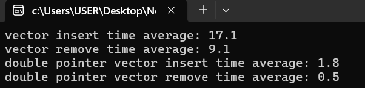

# cpp-project

***
# part1:
  # Vector Implementation Performance Comparison

## Overview

This project compares the performance of two custom vector implementations in C++. The first implementation uses a single pointer for internal storage, while the second uses a double pointer. The comparison involves inserting and removing elements using both vector implementations and measuring the time taken for these operations.

## Components

- **SinglePointerVector**: A vector implementation using a single pointer for internal storage.
- **DoublePointerVector**: A vector implementation using a double pointer for internal storage.
- **main.cpp**: Main file that includes both vector classes and performs the performance comparison.

## One of my test example:

The vector that made by double pointer is working faster than the other one.

# part2:
# Geometric and Physical Calculation Headers

This repository contains three C++ header files designed for geometric and physical calculations: `poly.h`, `shape.h`, and `device.h`. These headers provide functionalities to create geometric shapes, calculate their properties, and compute physical characteristics based on those shapes.

## Headers Overview

### `poly.h`

The `poly.h` header file contains definitions and functions for creating 2D polygonal shapes.
  
### `shape.h`

The `shape.h` header file extends 2D shapes into 3D shapes via a height and density parameter, calculate their volume, surface area and mass.

### `device.h`

The `device.h` header file computes physical properties related to the shape and the device using vectors.

#### Key Functions

- **`double mass()`**
  - Computes the mass of the shape based on shapes and sub-devices properties.

- **`double volume()`**
  - Computes the volume using the shape's properties.

- **`double surface()`**
  - Computes the surface area using the shape's properties.

